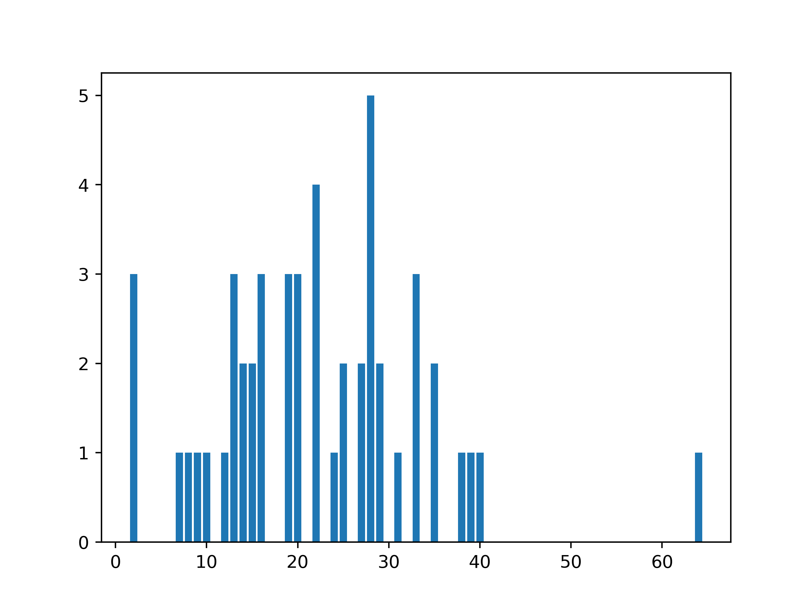
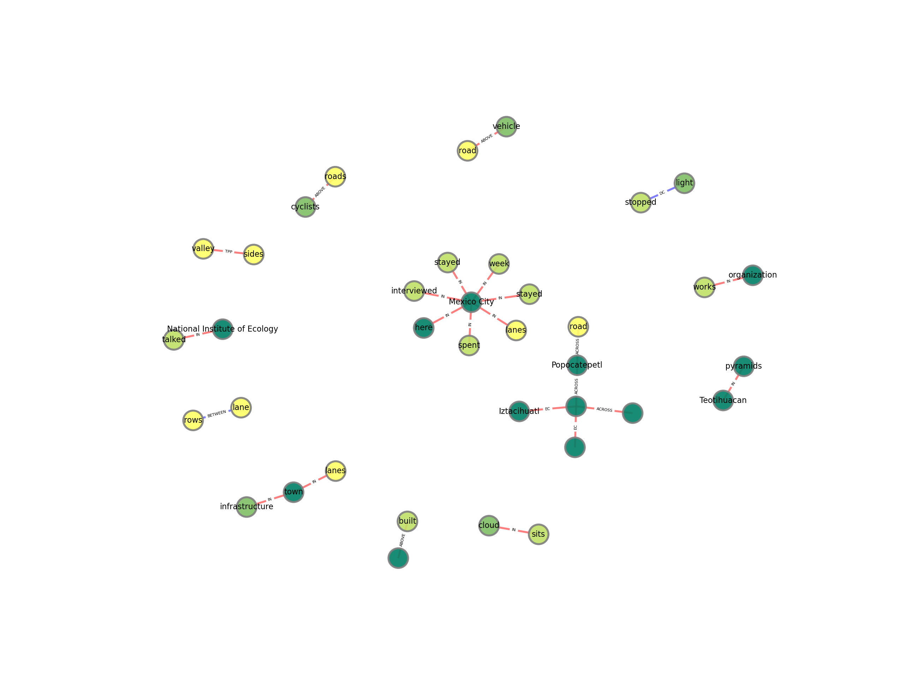
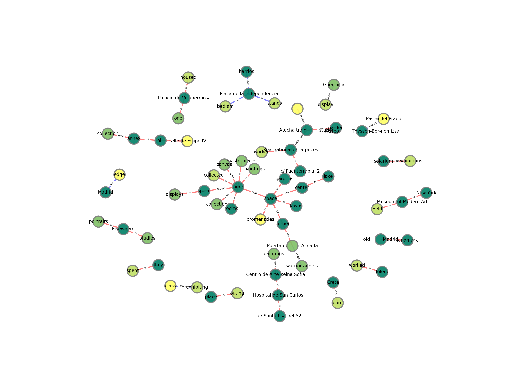

# t2s-fingeruebung
Fingerübung zum Praktikum Text2Scene im WiSe 21-22, Goethe Universität Frankfurt am  Main.
By Arne Gideon

## Installation

### Python Preparation
Requires a working version of either `anaconda` or `miniconda`.

Create a new environment with name
`NAME` with the command `conda create -n NAME spacy` and confirm the `Proceed?` message by
typing in `y`.
This downloads the required libraries for the spacy tagger.
Activate the new environment with `conda activate NAME`.
You also need to install the english language package for the spacy tagger with the command
`python -m spacy download en_core_web_sm`.

You need to install some additional python libraries into this evnironment. Use
`conda install xmltodict matplotlib networkx` to install the needed tools.

### File setup
Now download the newest release version (`.zip`) and unzip it into a new folder.
`cd` into this folder.

## Running

### Analyze some basic stats
You can run the program from the project root folder with `python src/main.py FILES` where
`FILES` is a list of file names in the `src/data/training-data/Traning` folder that you
want to analyze. For example, `python src/main.py RFC/Amazon.json ANC/WhereToMadrid/Bourbon_Madrid`
analyzes the 2 files and prints the results in the console.

### Visualize an Entity Graph
By running `python src/main.py --graph RFC/Bicycles`, the program puts a `.png` with a graph
into `src/data/json/RFC/Bicycles.png`. It contains the relations between the locations etc. in
the original `.xml` file. The file also gets analyzed like described above.


## Results
### 2.3
Results are all visible in console output. For example:
```
>>> python src/main.py RFC/Bicycles.xml RFC/Amazon.xml
main.py
Text2Scene Pratkikum WiSe 21-22 Fingerübung.

Reads IsoSpace XML-Data from Files, tokenizes and tags read data using Spacy.
Collected Data can then be saved in JSON.
Includes some crude analysis tools and a visualizer to show a network graph of the XML contents.

PoS counts:
PROPN:  82
CCONJ:  54
SPACE:  17
PUNCT:  218
NOUN:  329
NUM:  36
VERB:  206
DET:  178
ADP:  184
ADJ:  130
PRON:  104
ADV:  68
SCONJ:  27
AUX:  64
SYM:  1
PART:  35
X:  4


IsoSpace tag counts:
place:  86
path:  19
spatial_entity:  75
nonmotion_event:  19
motion:  44
spatial_signal:  29
motion_signal:  19
measure:  4
qslink:  41
olink:  10
movelink:  48
mlink:  4
metalink:  101


QsLink Type counts:
EC:  7
IN:  29
TPP:  3
DC:  1
EQ:  1


QsLink preposition counts:
Qslink Triggers:
on:  2
in:  13
where:  3
At:  1
on top:  1
at:  3
of:  3
In:  1
Everywhere:  1

OLink Triggers:
on:  2
between:  1
on top:  1
of:  2
neighboring:  1


5 most common motion verbs:
following:  1
weaving:  1
took over:  1
use:  1
pass:  1
```
The sentence lengths are visualized as a bar chart in `src/sentence-lengths.png`:


### 2.4
The compiled graphs are placed in `src/data/json/...`.

Colors are as follows:
-  Places
-  Locations
-  Spatial Entities
-  Non-Motion Events
-  Paths

Edge Colors are:
-  QSLink
-  OLink

`RFC/Bicycles.xml`:

`ANC/WhereToMadrid/Highlights_of_the_Prado_Museum.xml`:
